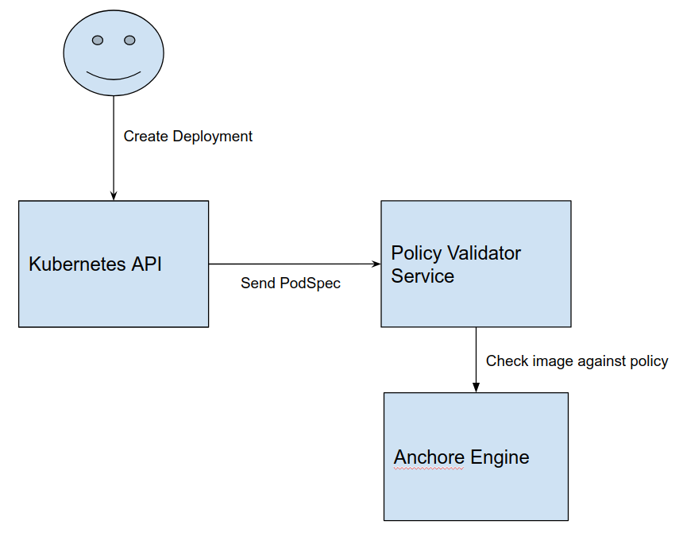

# Anchore Image Validator for Kubernetes

## THIS IS NOT AN OFFICIAL GOOGLE PRODUCT

## Intro

[Anchore Engine](https://github.com/anchore/anchore-engine) provides a mechanism to scan Docker images and then evaluate them against
a set of policies. This evaluation result can be used to gate a CI pipeline or, as used in this repo,
to gate the deployment of an image into a Kubernetes cluster.

This repository contains a server that can be used as a [Validating Webhook](https://kubernetes.io/docs/admin/admission-controllers/#validatingadmissionwebhook-alpha-in-18-beta-in-19)
in your Kubernetes cluster. After its been configured, Kubernetes will send a request to this server any time a Pod is requested.
The server will get container images out of the PodSpec and check them against the Anchore Engine API to see if they
adhere to the policy that has been defined. If the image does not yet exist in Anchore Engine it will automatically be added
and scanned. The [default policy](anchore-policy-validator/templates/default-policy/configmap.yaml) validates that there are no critical security vulnerabilities in the image.

## Quick Start

1. [Install Helm](https://github.com/kubernetes/helm/blob/master/docs/install.md)

1. Run `hack/install.sh` which installs the [chart](anchore-policy-validator) for the server.

1. Follow the instructions output by the chart installation for installing the validating web hook.

## How does it work?

This server leverages the [Generic Admission Server](https://github.com/openshift/generic-admission-server)
for most of the heavy lifting of implementing the admission webhook API.

The binary from this repository is registered as an [API Service](https://kubernetes.io/docs/tasks/access-kubernetes-api/setup-extension-api-server/)
and run inside of Kubernetes. Once the service is registered, a ValidatingWebhookConfiguration is created
that tells the Kubernetes API server to check with the admission server before running any pods in the local cluster.

The admission server receives a request that includes the Pod specification. It takes the images from the list of containers
then sends requests to the [Anchore Engine API](https://app.swaggerhub.com/apis/anchore/anchore-engine/0.1.0) to ensure 
that the [images are passing the evaluation](https://github.com/anchore/anchore-engine/wiki/Evaluating-Images-against-Policies)
of the [policy defined in Anchore Engine](https://github.com/anchore/anchore-engine/wiki/Working-with-Policies).